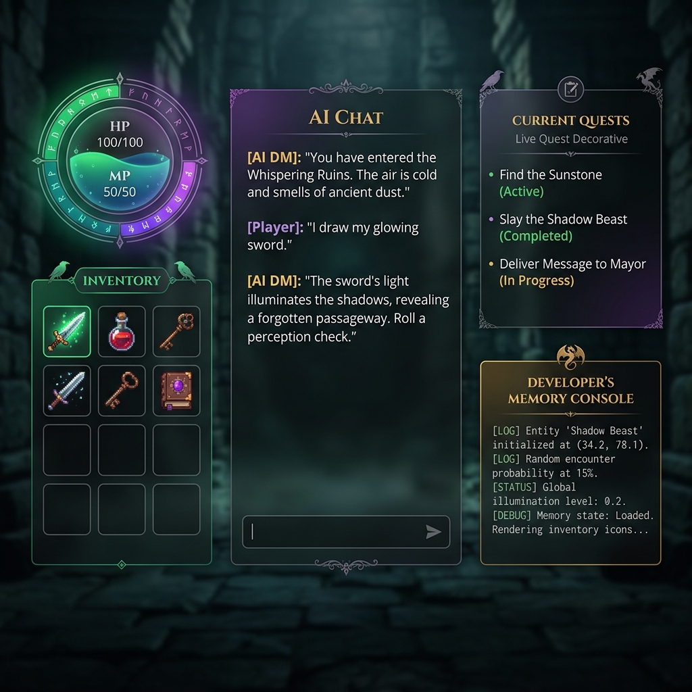

# 📜 QuestLog - AI RPG Dungeon Master with Eternal Memory

> **An immersive dark-fantasy RPG showcase utilizing the Memori SDK.**
>
> 🚀 **Live Demo:** [https://questlog-aysb.onrender.com/](https://questlog-aysb.onrender.com/)



QuestLog is a text-based dark fantasy RPG where you interact with an AI Dungeon Master (DM) that **never forgets**. 

Created for the **Open Source Hackathon 2026**, this project demonstrates how to solve a major limitation of LLM-driven gaming: **context memory loss** (where the AI forgets your weapons, items, quest journal progress, and met NPCs after several turns). Using the **Memori SDK**, every major milestone, item acquired, damage taken, and faction relation is captured as persistent facts in the background and recalled automatically to ensure deep narrative consistency across sessions.

---

## 🔮 Core Features

1. **Eternal Memory Integration**: Powered by the **Memori SDK**, your accomplishments are persisted and dynamically injected into the Dungeon Master's context.
2. **Real-time Glassmorphic Dashboard**: A gorgeous dark-fantasy interface with glowing gold/emerald/violet overlays, animated HP meters, dynamic inventory slots, and live quest logs.
3. **Developers' Memory Console**: A dedicated debugger showing exactly which memories the Memori SDK has pulled to guide the DM's turn in real time.
4. **Multi-Model Support & Secure Settings**: Configure your **OpenAI GPT-4o-mini** or **Google Gemini 1.5 Flash** credentials, plus your **Memori API Key** directly inside the UI. It features a **Production Environment Lock** that automatically hides key configuration panels if credentials are pre-set in server variables. Or run in offline **Local Sandbox Mode** with standard state fallbacks!
5. **Fast & Portable**: Built purely with FastAPI, Uvicorn, and Vanilla ES6 Javascript.

---

## 🏰 Architecture

```
   +---------------------------------------------------------+
   |                  STUNNING FRONTEND (SPA)                |
   |   [Adventurer Dashboard]     [Developers' Memory Panel] |
   +---------------------------+-----------------------------+
                               |
                   HTTP POST   |   /api/chat
                               v
   +---------------------------------------------------------+
   |                     FASTAPI BACKEND                     |
   |                                                         |
   |  1. Recall memories   =======>   `mem.recall()`         |
   |  2. Enrich prompt     =======>   System System Context  |
   |  3. Narrative generation ==>   OpenAI GPT-4o-mini      |
   |  4. Capture DM turn   =======>   `mem.capture_turn()`   |
   |  5. State Extraction  =======>   JSON Parser            |
   +---------------------------+-----------------------------+
                               |
                               v
   +---------------------------------------------------------+
   |                     MEMORI CLOUD API                    |
   |         - Semantic Facts   - Temporal Memory            |
   |         - Advanced Augmentation Background Tasks        |
   +---------------------------------------------------------+
```

---

## 🛠️ Quick Start (Windows Setup)

Make sure you have **Python 3.10+** and **Node.js** installed on your system.

### 1. Clone & Enter Directory
```powershell
cd c:\Users\Lenovo\Desktop\QuestLog
```

### 2. Configure Environment
Copy the configuration template:
```powershell
copy .env.example .env
```
Open `.env` and fill in your API credentials:
* **`OPENAI_API_KEY`**: Your OpenAI API key for narrative generation (optional if using Gemini).
* **`GEMINI_API_KEY`**: Your Google Gemini API key (optional if using OpenAI, recommended free tier).
* **`MEMORI_API_KEY`**: Get a free key at [app.memorilabs.ai](https://app.memorilabs.ai) to unlock eternal memory augmentation.

*(You can also configure these keys interactively inside the web UI once running!)*

### 3. Install Dependencies
```powershell
python -m pip install -r requirements.txt
```

### 4. Run the Web Server
Launch the FastAPI uvicorn daemon:
```powershell
python app.py
```

### 5. Play
Open your browser and navigate to:
👉 **[http://127.0.0.1:8000](http://127.0.0.1:8000)**

Forge your hero, write your background lore, and enter Eldoria!

### 🐳 Run with Docker (Alternative)
If you prefer to run containerized:
1. Build the Docker image:
   ```bash
   docker build -t questlog .
   ```
2. Run the container:
   ```bash
   docker run -p 8080:8080 -e PORT=8080 -e HOST=0.0.0.0 --env-file .env questlog
   ```
3. Open: **[http://127.0.0.1:8080](http://127.0.0.1:8080)**

---

## 🚀 Scaling in ECSoC (Elite Coders Summer of Code)

QuestLog's foundation is ready to be expanded during the **45-day ECSoC summer program**:

* **Bring Your Own Database (BYODB)**: Migrate vector searches to local scalable databases like **CockroachDB** or **TiDB Zero**.
* **Shared Multi-Hero Realms**: Let players step into the same world. Memori can track cross-entity relationships, so taverns whisper of another player's actions!
* **NPC Cognitive Processes**: Give major NPCs their own isolated memory stores to remember personal barters and player reputation.

---

## 🛡️ License

QuestLog is open-source software licensed under the **Apache 2.0 License**.
